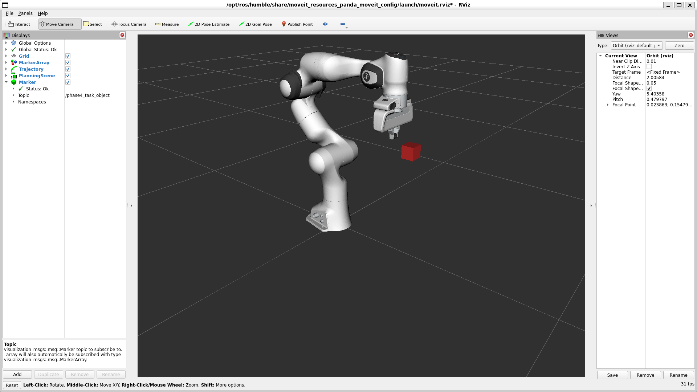
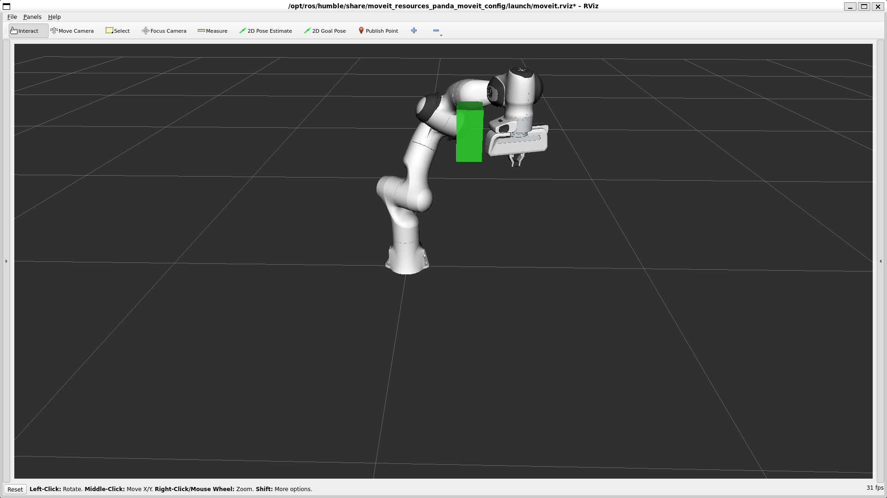
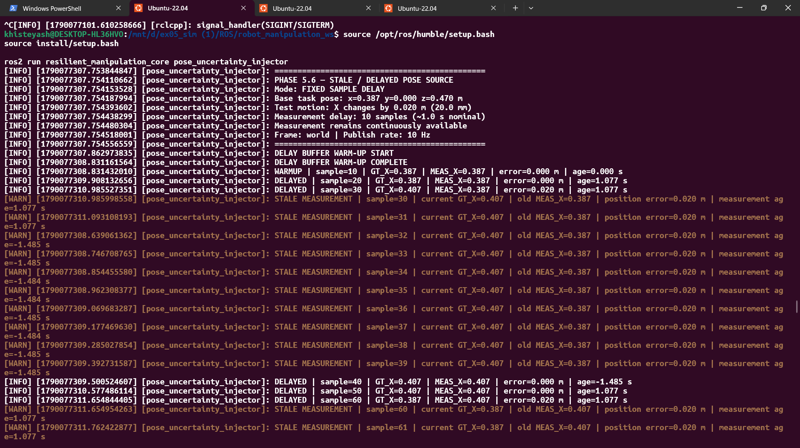
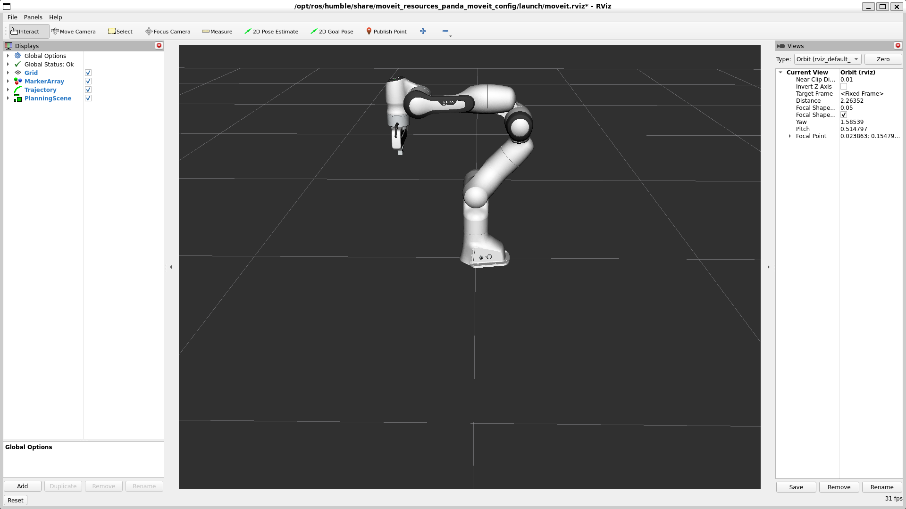

# ROS2 Resilient Manipulation & Motion Planning Testbed

[](https://docs.ros.org/en/humble/)
[](https://moveit.picknik.ai/)


**Collision-aware manipulation, pose-fault injection and stale-state protection for a Panda robot using ROS 2, MoveIt 2 and C++.**

## Manipulation mission



## Implemented capabilities

| Robot-state monitoring | Joint-space planning | Cartesian planning |
|:---:|:---:|:---:|
| **Implemented** | **Implemented** | **Implemented** |

| Collision-aware planning | Mission sequencing | Stale-pose detection |
|:---:|:---:|:---:|
| **Implemented** | **Implemented** | **Verified** |

## Engineering evidence

| Collision-aware planning | Stale-pose fault handling |
|:---:|:---:|
|  |  |

| MoveIt 2 baseline | End-to-end mission |
|:---:|:---:|
|  |  |

▶️ [Watch the manipulation mission demo](docs/evidence/manipulation_mission_demo.mp4)

## What this project demonstrates

- Integrated a simulated Franka Emika Panda manipulator with ROS 2 Humble and MoveIt 2.
- Implemented C++ nodes for robot-state monitoring and multiple motion-planning modes.
- Generated joint-space and Cartesian trajectories through dedicated launchable planners.
- Added collision objects and verified obstacle-aware motion planning in RViz.
- Sequenced multiple planning stages into an end-to-end manipulation mission.
- Injected pose uncertainty and delay to exercise failure-aware manipulation logic.
- Verified detection of stale pose information before unsafe continuation.

## ROS 2 nodes

| Executable | Engineering role |
|---|---|
| `panda_state_monitor` | Monitors Panda joint-state feedback |
| `joint_space_planner` | Plans motion to joint-space goals |
| `cartesian_path_planner` | Generates Cartesian end-effector paths |
| `obstacle_avoidance_planner` | Plans with collision objects in the scene |
| `manipulation_mission` | Sequences the multi-stage manipulation workflow |
| `pose_uncertainty_injector` | Injects controlled pose uncertainty and delay |

## System flow

```text
Robot state / pose
        │
        ├── State monitoring
        ├── Pose uncertainty and delay injection
        │
        ▼
Freshness and validity check
        │
        ▼
MoveIt 2 motion planning
        │
        ├── Joint-space planning
        ├── Cartesian planning
        └── Collision-aware planning
        │
        ▼
Manipulation mission execution
```

## Build and run

### Requirements

- Ubuntu 22.04
- ROS 2 Humble
- MoveIt 2
- `moveit_resources_panda_moveit_config`
- C++17-compatible compiler
- colcon

### Build

```bash
cd ~/robot_manipulation_ws
source /opt/ros/humble/setup.bash
colcon build --symlink-install
source install/setup.bash
```

### Run individual capabilities

```bash
ros2 launch resilient_manipulation_core joint_space_planner.launch.py
ros2 launch resilient_manipulation_core cartesian_path_planner.launch.py
ros2 launch resilient_manipulation_core obstacle_avoidance_planner.launch.py
```

### Run the manipulation mission

```bash
ros2 launch resilient_manipulation_core manipulation_mission.launch.py
```

## Repository structure

```text
.
├── docs/evidence/                         Curated recruiter-facing evidence
└── src/resilient_manipulation_core/
    ├── launch/                            ROS 2 launch files
    ├── src/                               C++ implementation
    ├── CMakeLists.txt                     Build configuration
    └── package.xml                        ROS 2 package manifest
```

## Current status

### Implemented and evidenced

- [x] Panda/MoveIt 2 simulation baseline
- [x] Joint-state monitoring
- [x] Joint-space planning
- [x] Cartesian path planning
- [x] Collision-aware obstacle planning
- [x] Multi-stage manipulation mission
- [x] Pose-uncertainty injection
- [x] Stale/delayed pose detection

### Planned resilience extensions

- [ ] EKF/UKF-based pose estimation
- [ ] Controlled noise, bias and dropout scenarios
- [ ] Fault classification and health-state reporting
- [ ] Bounded recovery actions
- [ ] Unsafe-continuation prevention
- [ ] Automated regression harness
- [ ] Pose RMSE, planning success and recovery-latency metrics

The roadmap is intentionally separated from verified work so the repository does not imply unfinished capabilities are already complete.

## Author

**Yash Khiste**  
M.Sc. Electrical Engineering and Information Technology  
Otto von Guericke University Magdeburg  
[LinkedIn](https://www.linkedin.com/in/yash-khiste-95b8371a9)
